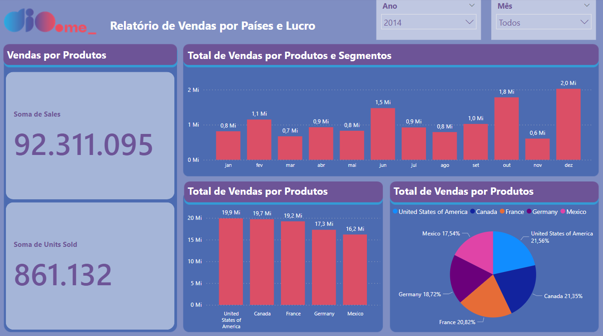

# 🚀 Formação Power BI Analyst
>Desafios dos Projetos do [DIO](https://www.dio.me/users/wandervilhalvadomingos)

## Sobre os Projetos

Neste projeto você irá replicar páginas já criadas durante o curso com a sample disponibilizada. Acesse o link do Github para ter acesso aos dados: [Juliana Zanelatto](https://github.com/julianazanelatto/power_bi_analyst) 

# Projeto 1: Analisando Dados com meu Primeiro Projeto no Power BI

- **Descrição:** Esse desafio visa treinar a habilidade de criação de visuais. Assim, você poderá criar familiaridade com esses recursos. Em módulos mais avançados iremos tratar do layout mais elaborado dos nossos relatórios.

- **Arquivos:** `Financial Sample PBI.pbix`
- [**Dashboard - online**](https://app.powerbi.com/view?r=eyJrIjoiODgwZDUyYjgtMWFmMC00NmI5LWI2OGYtNzBkNjE0NTM0ZjkyIiwidCI6IjlmZjQ5YWNkLTJmNTMtNGJmMS04OTkwLTRjYzY0ZGM4YjljMiJ9&pageName=ReportSection052c629dce96c532e034)

O Dashboard é composta por: 

- Visual mapa 1: Soma de sales e unidades vendidas por país; 
- Visual mapa 2: Soma de lucro (profit) por país; 
- Visual de pizza: Lucro por segmento; 

Além disso: 

- Verifcar a disposição dos visuais no relatório;
- Modificar os nomes dos visuais para algo mais claro e direto (de acordo com o contexto);
- Atenção aos campos que são utilizados como dicas de ferramentas;  
- Publicar o relatório; 
- Compartilhar como suplemento no Power Point. 

 

# Projeto 2: Criando um Relatório de Vendas Elegante com Power BI

- **Descrição:** Criar um relatório mais elaborado com base na sample financials do Power BI.
- **Arquivos:** `Dio-Desafio-Modulo02.pbix`
- [**Dashboard - online**](https://app.powerbi.com/view?r=eyJrIjoiZTBiNzgzY2EtOTA1Ni00ZDhiLWFjNDktMDU2NTE1MzQ0NDc5IiwidCI6IjlmZjQ5YWNkLTJmNTMtNGJmMS04OTkwLTRjYzY0ZGM4YjljMiJ9)

**Objetivos:** 
- Definir estrutura 
- Adicionar botões de navegação que fornecem navegabilidade 
- Adicionar segmentadores utilizados e botões com imagem associado 
- Utilizar os indicadores e botões para selecionar diferentes visuais sobre um mesmo assunto 
- Publique o seu relatório no Power BI Service 
- Submenta seu projeto através do link no github 

 

# Projeto 3: Processando e Transformando Dados com Power BI

- **Descrição:** Criar uma base de dados com o Banco de Dados MySQL, fazer a conexão com o Power BI, processar e tratar os dados, criar uma visualização simples.
- **Arquivos:** `Dio-Desafio-Modulo03.pbix`

- **Passos:**
1. Criar a base company no Banco de Dados MySQL;
2. Executar o script para criar estrutura da base;
3. Executar o script de Insert dos dados;
4. Conectar o Power BI com MySQL
5. Fazer a Transformação dos dados;
6. Criar uma Visualização simples.

 

# Projeto 4.1.: Criando um Star Schema para Cenários de Vendas com Power BI

- **Descrição:** Criar o diagrama dimensional – star schema – com base no diagrama relacional disponibilizado.
- **Arquivos:** `Dio-Desafio-Modulo04.pbix`

 

# Projeto 4.2.:

- **Descrição:** Em desenvolvimento
- **Arquivos:**

## Como Contribuir

Se você ama dados tanto quanto nós, sua contribuição é bem-vinda! Faça fork, adicione seus próprios insights ou sugira melhorias. Juntos, podemos tornar este projeto ainda mais incrível! 🤝💬

## Como Iniciar

1. Clone o repositório
2. Abra o arquivo principal no Power BI
3. Explore, descubra e divirta-se!
